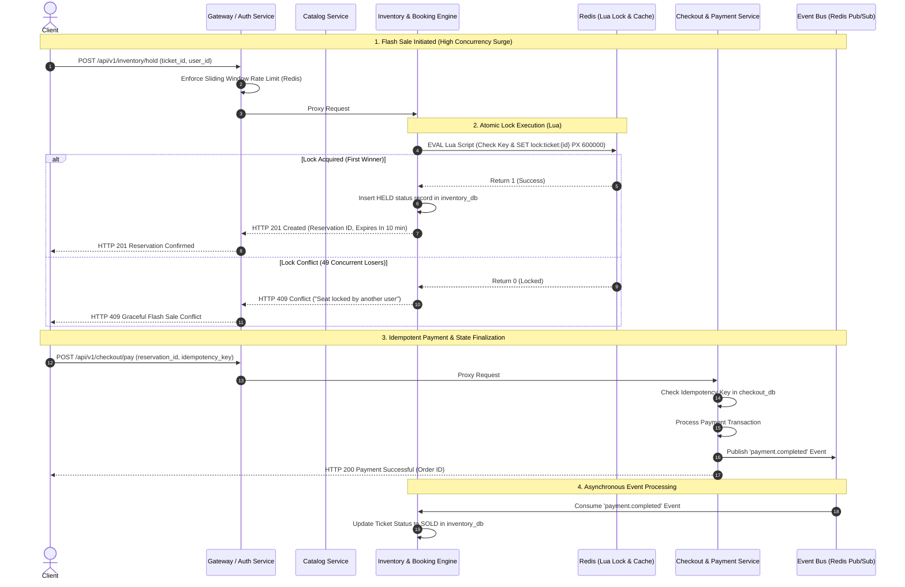

# Production-Grade Scalable Event-Driven Ticketing Microservices Platform

An enterprise-grade, event-driven microservices architecture built with **Python (FastAPI)**, **PostgreSQL (Database-per-Service)**, **Redis (Atomic Lua Concurrency Engine & Rate Limiting)**, and **Docker Compose**. Designed specifically to handle high-concurrency live event ticketing drops and flash sales (e.g., stadium show ticket releases) with **zero overselling** and strict domain boundary isolation.

---

## 🏛️ Architectural Strategy & Design Principles

### 1. Domain-Driven Service Boundary Isolation (Database-per-Service)
Each microservice owns its domain and database context exclusively. Shared databases are strictly avoided to eliminate implicit coupling.
- **Gateway & Auth Service (`services/gateway`)**: Entry point for API requests, JWT authentication/authorization, proxy routing, and Redis sliding-window rate limiting. Database: `auth_db`.
- **Event & Catalog Service (`services/catalog`)**: Manages venues, concerts, seating tiers, and metadata with high-performance Redis read caching. Database: `catalog_db`.
- **Inventory & Booking Service (`services/inventory`)**: The core high-concurrency engine. Manages seat holds, atomic Redis Lua locks, and inventory state transitions (`AVAILABLE`, `HELD`, `SOLD`). Database: `inventory_db`.
- **Checkout & Payment Service (`services/checkout`)**: Idempotent payment processing, order fulfillment, and event publishing (`payment.completed`, `payment.failed`). Database: `checkout_db`.

---

## 📊 Architectural Trade-Off Analysis & Comparison Matrix

| Architectural Pattern | High-Concurrency Flash Sale Handling | Data Consistency & Isolation | Team Autonomy & Deployment | Operational Overhead |
| :--- | :--- | :--- | :--- | :--- |
| **Monolith** | ❌ Vulnerable to total system collapse during spikes (single DB bottleneck) | ⚠️ Easy immediate consistency, but tight database coupling | ❌ Low (shared codebase & release cycles) | ✅ Very Low |
| **Serverless (FaaS)** | ⚠️ Risk of database connection exhaustion (`max_connections`) during sudden traffic spikes | ⚠️ Difficult distributed transaction management | ✅ High | ⚠️ Cold starts & vendor lock-in |
| **Pure Event-Choreography** | ⚠️ Complex debugging & eventually consistent state tracking | ⚠️ High eventual consistency delay | ✅ High | ❌ High complexity & tracing overhead |
| **Our Microservices + Redis Atomic Engine (Chosen)** | ✅ **Optimal**: Handles thousands of concurrent locks in Redis without hitting DB contention | ✅ **Strong**: Strict Database-per-Service + Event Bus for state synchronization | ✅ **High**: Independent services, isolated DB schemas | ⚖️ **Moderate**: Container orchestration & Redis Pub/Sub |

### Architectural Decision Record (ADR)
1. **Why Redis Lua Scripts for Inventory Hold?**
   - Traditional database transactions (`SELECT FOR UPDATE`) under 500+ concurrent requests cause lock wait timeouts and database CPU saturation.
   - Redis executes Lua scripts **atomically in a single-threaded execution model**, guaranteeing that check-and-lock operations occur in $< 1 \text{ ms}$ with **zero race conditions and zero double-booking**.
2. **Why Event-Driven Asynchronous Checkout?**
   - Payment gateways introduce variable latency (500ms - 3000ms).
   - By publishing `payment.completed` asynchronously over Redis Pub/Sub, the Inventory worker updates seat state without blocking the user-facing HTTP request thread.

---

## ⚡ High-Concurrency Flash Sale Sequence Diagram



---

## 📁 Repository Directory Structure

```
Ticketing Microservices Platform/
├── .env                            # Active environment configuration
├── .env.example                    # Environment configuration template
├── .gitignore                      # Git ignore rules (secrets, caches, DB volumes)
├── pyproject.toml                  # Project-wide Ruff linter configuration
├── pytest.ini                      # Pytest suite configuration
├── docker-compose.yml              # Multi-container orchestration (DBs, Redis, Services)
├── README.md                       # Comprehensive architecture & operational documentation
├── scripts/
│   ├── init-db.sql                 # Multi-database initializer (auth_db, catalog_db, etc.)
│   └── test_flash_sale.py          # High-concurrency surge test simulation script
├── services/
│   ├── common/                     # Shared utilities across all services
│   │   ├── auth.py                 # JWT token generation & validation
│   │   ├── config.py               # Central Pydantic environment configuration
│   │   ├── event_bus.py            # Redis Pub/Sub async event broker
│   │   └── redis_client.py         # Async Redis connection pool
│   ├── gateway/                    # Gateway & Auth Service (Port 8001)
│   │   ├── auth_routes.py          # /auth/register, /auth/login, /auth/me
│   │   ├── rate_limiter.py         # Redis sliding-window rate limiter
│   │   └── main.py                 # Gateway proxy router & application entrypoint
│   ├── catalog/                    # Event & Catalog Service (Port 8002)
│   │   ├── routes.py               # Venues, events, seat categories (cached in Redis)
│   │   └── main.py
│   ├── inventory/                  # Inventory & Booking Service (Port 8003)
│   │   ├── reservation_engine.py   # Redis Lua atomic lock engine
│   │   ├── worker.py               # Background Pub/Sub event subscriber
│   │   └── main.py
│   └── checkout/                   # Checkout & Payment Service (Port 8004)
│       ├── payment_processor.py    # Idempotent payment gateway simulator
│       └── main.py
└── tests/                          # Automated Pytest suite
    ├── conftest.py                 # Async SQLite in-memory DB fixtures & ASGI clients
    ├── test_auth.py                # JWT & Auth unit/integration tests
    ├── test_catalog.py             # Venue & Event catalog CRUD tests
    ├── test_inventory_engine.py    # Atomic Lua seat reservation & conflict tests
    └── test_checkout.py            # Idempotent payment & event publishing tests
```

---

## 🚀 Quick Start & Local Execution Guide

### Prerequisites
- [Docker Desktop](https://www.docker.com/) (with Docker Compose V2)
- Python 3.11+ (for local test execution)

### 1. Launch All Microservices
From the project root directory, spin up all 4 microservices, PostgreSQL databases, and Redis:

```bash
docker compose up --build -d
```

Check the health status of all running containers:
```bash
docker compose ps
```

### 2. Verify Service Endpoints & OpenAPI Specs
Once containers are healthy, access the swagger documentation for each service:
- **API Gateway & Auth**: [http://localhost:8001/docs](http://localhost:8001/docs)
- **Catalog Service**: [http://localhost:8002/docs](http://localhost:8002/docs)
- **Inventory Service**: [http://localhost:8003/docs](http://localhost:8003/docs)
- **Checkout Service**: [http://localhost:8004/docs](http://localhost:8004/docs)

---

## 🧪 Automated Testing & Concurrency Verification

### 1. Pytest Unit & Integration Test Suite
The platform includes an automated `pytest` test suite with in-memory SQLite fixtures (`sqlite+aiosqlite`) and `httpx.AsyncClient` ASGI test clients that run without requiring external services.

Run the full test suite:
```bash
pytest -v
```

#### Test Execution Output:
```text
tests/test_auth.py::test_password_hashing_unit PASSED                    [ 10%]
tests/test_auth.py::test_jwt_token_unit PASSED                           [ 20%]
tests/test_auth.py::test_jwt_invalid_token_unit PASSED                   [ 30%]
tests/test_auth.py::test_register_and_login_flow PASSED                  [ 40%]
tests/test_catalog.py::test_venue_and_event_catalog_flow PASSED          [ 50%]
tests/test_catalog.py::test_create_event_invalid_venue PASSED            [ 60%]
tests/test_checkout.py::test_idempotent_payment_processing PASSED        [ 70%]
tests/test_checkout.py::test_payment_failure_simulation PASSED           [ 80%]
tests/test_inventory_engine.py::test_ticket_creation_and_listing PASSED  [ 90%]
tests/test_inventory_engine.py::test_hold_ticket_success_and_conflict PASSED [100%]

============================= 10 passed in 12.37s =============================
```

---

### 2. High-Concurrency Flash Sale Surge Simulation
To empirically prove zero overselling under heavy traffic surge conditions, run the included async stress testing script:

```bash
python scripts/test_flash_sale.py
```

#### Simulation Output Demo:
```text
======================================================================
🚀 STARTING FLASH SALE HIGH-CONCURRENCY SIMULATION
======================================================================
✅ Registered test user: buyer_17897468@example.com (ID: c784a-...)
🎟️ Created Event 'Mega Stadium World Tour' with 5 seats
✅ Seeded 5 tickets in inventory

⚡ SURGE TRAFFIC: Spawning 50 concurrent buyers racing for 5 seats...

📊 FLASH SALE CONCURRENCY RESULTS:
  - Total Requests Sent: 50
  - Successful Holds: 5 / 5 seats (HTTP 201)
  - Graceful Conflicts: 45 (HTTP 409)
  - System Errors / Unexpected: 0

🎉 VERIFICATION PASSED: Zero overselling observed! Redis Lua locks successfully prevented race conditions.
```

---

## 🛡️ Security & Production Readiness Highlights
- **Stateless JWT Security**: Requests to downstream services are validated via Bearer tokens.
- **Sliding-Window Rate Limiting**: Mitigates automated bot scalping and DDoS attacks at the API Gateway level.
- **Idempotency Control**: Payments require an idempotency key to prevent accidental duplicate charges.
- **Connection Pooling**: PostgreSQL connections are pooled per service with `pool_size=20-30` and `max_overflow=10-20` to prevent connection exhaustion.
